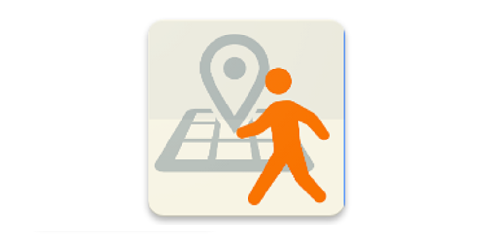
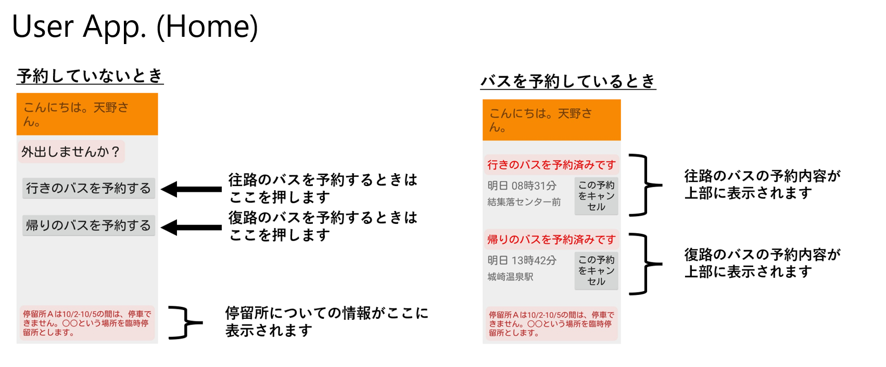
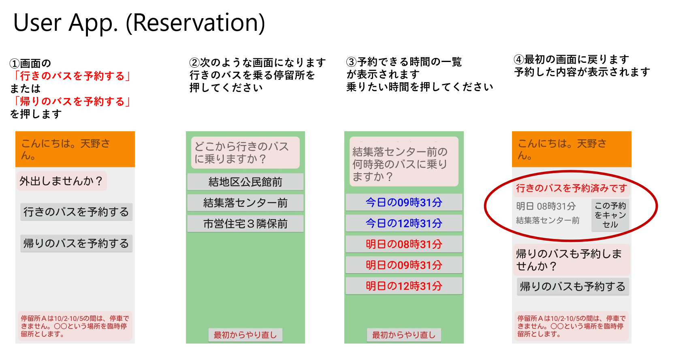
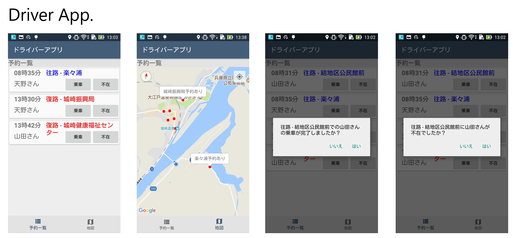
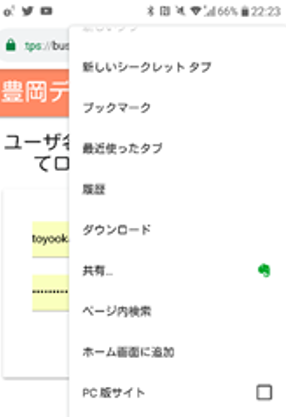

# Demand Bus System

The system is largely composed of the following four software components:

- API Server (Python Django)
- User App 
    - v1 Android
    - v2 Web (vue.js)
- Driver App (Android App)
- Admin Web (Python Django)

The system supports Japanese only throughout.

## User App (v1).

## Driver App.

# Initial Setting Fow (v2) 

#### Preparation

1.	地区の追加: 
    - バスは往路（目的地以外→目的地）と復路（目的地→目的地以外）の2種類ある．目的地のバス停が属する地区はis destinationをtrueにする．
2.	運行時間の追加: 
    - Primary key順にドライバーに表示される（はず）なので分かりやすい順に追加
3.	停留所追加:
    - Primary key順にユーザに表示されるので，なるべく利用者に配られる時刻表などと同順に．
4.	ユーザの追加:
    - ドライバーアプリで使うユーザにはis driverのチェックを入れておく．ユーザ名は前回は歴史的経緯により数字だったが文字列型であつかっているので，文字列でも可.
    前回は姓・名が逆になっていたが，修正したので，姓には姓を，名には名を．
5.	停留時刻追加
6.	運休曜日を追加
    - 前回はプログラム中で処理していたので，今回新たに追加．先方に確認して，忘れずに設定お願いします．（前回は火・木・土・日は運休だった．）

#### ユーザーアプリ・端末設定
- ユーザアプリはv1はAndroidアプリ，v2はWebアプリ（Vue.js)として実装している．
- 任意のWebサーバでWebアプリをホストし，リンクをホーム画面に追加（下記画像参考） WPA
- 配布時には予め作成済みアカウントでログインしておく．
- ログアウト
    -	ログアウトボタンはない(間違ってログアウトされるのを防ぐため
    -	https://bus-yoyaku.higashino-lab.org/#/logout (old uri)
    - ログイン状態で上記アドレスにアクセスするとログアウト
-	以前の認証情報が残っている場合，一度logoutする必要があるかもしれない？←読み込みが完了しない場合試す
-	端末Googleアカウント
    -	Google認証は利用していないので，端末のGoogleアカウントは何でもよい
    -	Androidアプリ(v1)ではGoogle認証でユーザを認証していたので各ユーザーと１つのgooogleアカウントを紐づけていた．v2はユーザアプリをWebアプリに移行しユーザー名とパスワードで認証している．
    -	ただしGoogleアカウントを管理したほうが端末紛失時に，Webからアカウントにログインして探せる．
        -	https://myaccount.google.com/intro/find-your-phone
    - 

### ドライバーアプリ設定
-	Google Play StoreでBuild済みドライバーアプリを限定公開している.
    -	アプリをインストールし，右上のsettingからドライバーアカウント，地図の設定を行う
    -	ドライバーアカウント設定しても認証がうまくいかないときはアプリ再起動
 
### Admin Web 管理画面各項目について
- アラートリスト (Alert List)
    -	ユーザのWebアプリの下部に赤文字で表示される．バス停の一時停止や運休があるときに設定する．
    -	「○○停留所はXX日～XX日まで利用できません」
    -	ユーザを設定するとそのユーザにのみ表示
    -	エリアを設定するとそのエリアのユーザにのみ表示
    -	For all usersを設定するとすべてのユーザに表示
        - 複数設定するとuser < area < for all usersの順に優先される
    -	表示する開始日と終了日と表示するテキストを設定
- メッセージリスト (Message List)
    -	ユーザアプリの上部に表示．「おはよう」なメッセージをユーザに表示
    -	表示のされ方のみが異なり，その他の仕様はAlertと同じ．
- ユーザリスト (User List)
    -	ユーザを追加・削除できる．
    -	ドライバーアプリで利用するドライバーアカウントが少なくとも一つ必要．
        - ドライバーにアカウントにはis_dirverにチェックをつける．
    -	Staff権限をつけるとAdmin Webへログイン可能．
    -	スタッフやドライバーには地区設定しなくてもよい
    -	グループはデフォルトのまま．
- 予約リスト (Reservation List)
    -	予約の状態が予約完了または乗車中のもののみドライバーアプリに表示される．テストでドライバーに見せるときに注意．
- 停留所 (Bus Stop)
    - ユーザは，バスに乗る停留所だけを選択し予約する
    - Going：自分の地区と同じ地区の停留所のみ選択可能
    - Returning：目的地地区の停留所のみ選択可能
- 停留時刻 (Stop Time Lsit)
    - ユーザ・ドライバー側ではTIMEでソートされる．Primary Keyは自動的に付与される．
- 地区リスト (Area List)
-	目的地地区にはis_destinationをつける
- 運休リスト (Days Out of Service)
-	設定した停留所は，設定した期間の乗車が予約ができなくなる
- 運休曜日
- 運行時間リスト (Operation Time Slots)
    - display nameのところがドライバーアプリにそのまま反映される．
    - 往路復路の設定をまちがいやすい 

### Deployed Server Info